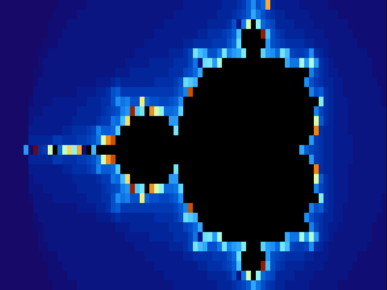

<br />
<p align="center">
  <h1 align="center">Mandelbrot Set in C</h1>

  <p align="center">
    A very simple C implementation of the Mandelbrot set
  </p>
</p>


## About The Project

This implementation provides a simple, interactive view of the Mandelbrot set. It has support for zooming, moving and changing the number of iterations. It supports two color maps: grey scale and a rainbow-like color map.



## Getting Started

To get a local copy up and running follow these simple steps.

### Prerequisites

You need to the following to be able to compile and run the project

* [Make](https://www.gnu.org/software/make/)
* A terminal that supports ANSI escape codes

### Setup

To set up the program, run the following commands:
```sh
    git clone git@github.com:BugelNiels/mandelbrot-c.git
    make
```

### Running

You can run the project as follows:

```sh
./mandelbrot
```